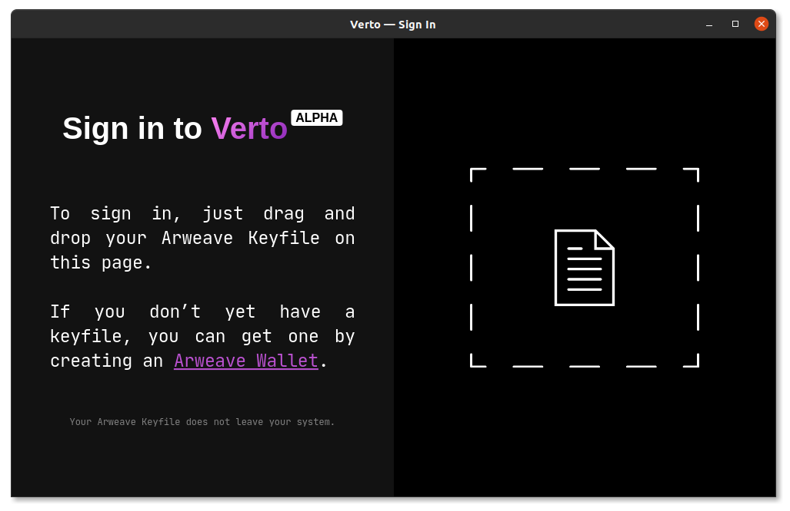

<p align="center">
  <a href="https://verto.exchange">
    
  </a>

  <h3 align="center">Verto Desktop</h3>

  <p align="center">
    All of verto's website in a tiny desktop app
  </p>

  <p align="center">
    
  </p>

</p>

## About

This repository contains all of the necessary code for Verto's desktop app.

You can access the code for our website [here](https://github.com/useverto/verto).

> Important Notice: Verto is in its Alpha stage. If you have a suggestion, idea, or find a bug, please report it! The Verto team will not be held accountable for any funds lost.

## Building from source

### Prerequisite

Before building the desktop application, you will need `go` installed on your machine.

### Building

**Unix**
```sh
# build the website
make web
# build the desktop binary
make build
```

**Windows**
```sh
# compile website
go run useverto/desktop/fs/embed.go -src=./verto/__sapper__/export
# build the executable
go build -ldflags="-H windowsgui" .
```

### Packaging the binary

**Linux**

```shell script
# create debian
sh ./tools/create_deb.sh
# install debian
sudo dpkg -i verto-desktop_0.1.0_amd64.deb
```

**MacOS**

```shell script
# create mac app
sh ./toos/create_mac_app.sh
# run the application
open Verto.app
```
**Windows**

```ps1
# download Wix Toolset 3 (skip if you already have it installed)
curl -OLS https://github.com/wixtoolset/wix3/releases/download/wix3111rtm/wix311.exe
.\wix311.exe /install /quiet /norestart

# create MSI installer for the built binary (make sure you have wix in your PATH env var)
candle.exe -out Verto.wixobj Verto.wxs
light.exe -b ./win Verto.wixobj -out Verto.msi
```

## License

The code contained within this repository is licensed under the MIT license.
See [`./LICENSE`](./LICENSE) for more information.
